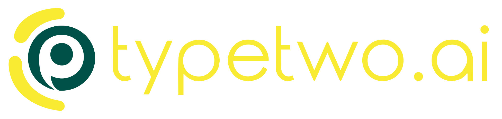
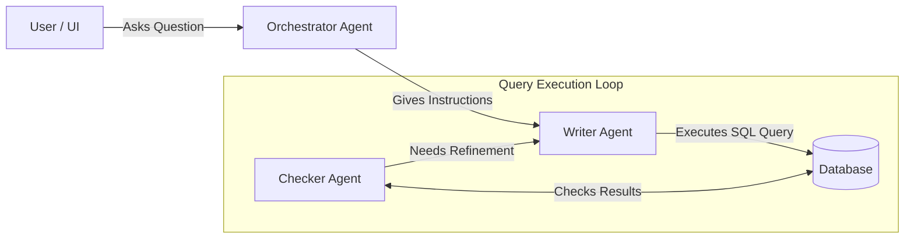
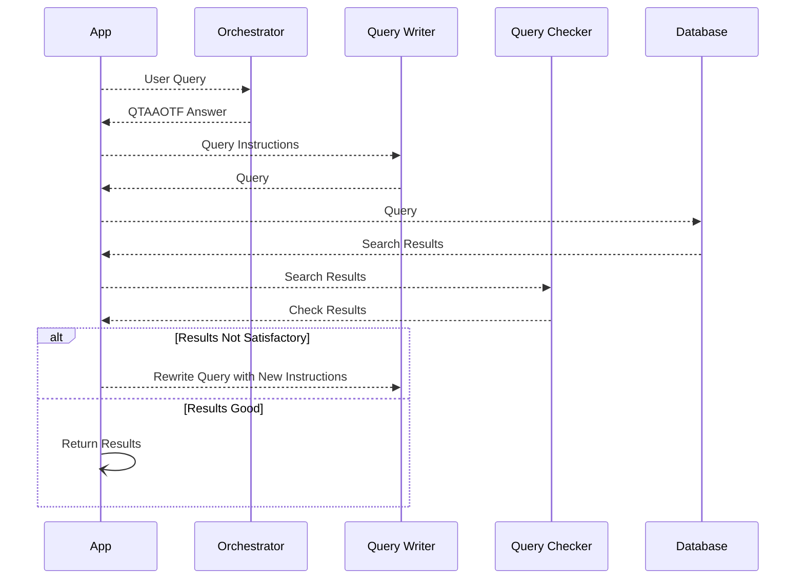

  

# typetwo ai

AI agent for drug discovery. Retrieve, verify, and analyze drug and medical data from specialized databases.

## Beta Preview

The AI agent is currently in beta. You can test the live version here:
[beta.typetwo.ai](https://beta.typetwo.ai/).

## Overview  

This system enables natural language search over relational drug and medical databases, currently supporting *ChEMBL 35*. Users can input queries in plain English, and the AI:  

- Interprets the request and generates a valid SQL query.  
- Executes the query on the database.  
- Analyzes the retrieved results to check for relevance and completeness.  
- If results are unsatisfactory, it refines the query and repeats the process until an accurate response is obtained.  

## Tech Stack

- **Frontend:** React + TypeScript + Vite  
- **Backend:** Python + Flask  
- **LLMs:** Gemini 2.0, Claude 3.5 with tools/function calling
- **Database:** Google Cloud SQL (currently hosting ChEMBL 35)  
- **Deployment:** Google Cloud (App Engine, Cloud Build)

## Project Links  

- **Project Website:** [https://typetwo.ai/](https://typetwo.ai/)  
- **Beta Deployment:** [https://beta.typetwo.ai/](https://beta.typetwo.ai/)

