<p align="center">
  
</p>

# typetwo ai: Autonomous Agent for Drug Discovery

Retrieve, verify, and analyze drug and medical data from specialized databases.

## Beta Preview

The AI agent is currently in beta. You can test the live version here:
[beta.typetwo.ai](https://beta.typetwo.ai/).

## Overview  

This system enables natural language search over relational drug and medical databases, currently supporting *ChEMBL 35*. Users can input queries in plain English, and the AI:  

- Interprets the request and generates a valid SQL query.  
- Executes the query on the database.  
- Analyzes the retrieved results to check for relevance and completeness.  
- If results are unsatisfactory, it refines the query and repeats the process until an accurate response is obtained.

```mermaid
graph TB
    User[User/UI] -->|Asks question| Orchestrator[🧠 Orchestrator Agent]
    
    subgraph Agent Loop
        Writer["📝 Writer Agent"]
        Checker[🕵️ Checker Agent]
        Database[(Database)]
    end
    
    Orchestrator -->|Gives instructions| Writer
    Writer -->|Executes SQL query| Database
    Database -->|Returns results| Checker
    Checker -->|Results bad| Writer
    Checker -->|Results good| User
```



## Tech Stack

- **Frontend:** React + TypeScript + Vite  
- **Backend:** Python + Flask  
- **LLMs:** Gemini 2.0, Claude 3.5 with tools/function calling
- **Database:** Google Cloud SQL (currently hosting ChEMBL 35)  
- **Deployment:** Google Cloud (App Engine, Cloud Build)


## Project Links  

- **Project Website:** [https://typetwo.ai/](https://typetwo.ai/)  
- **Beta Deployment:** [https://beta.typetwo.ai/](https://beta.typetwo.ai/)

## Instructions for Local Development

1. **Set Credentials**
   - Set up Application Default Credentials to access project's Google Cloud resources.
   - Reference: https://cloud.google.com/docs/authentication/provide-credentials-adc

2. **Configure Environment Variables**
   - In the `/frontend` folder, create the `.env` file with:
     ```
     VITE_NODE_ENV=local
     ```

3. **Allow Your IP to Access Cloud SQL**
   - Find your public IPv4 address using [WhatIsMyIPAddress](https://whatismyipaddress.com/).
   - Navigate to **Google Cloud Console** > **Cloud SQL** > **Connections** > **Networking**.
   - Add a new network:
     - Paste your IPv4 address into the **Network** field.
     - (Optional) Assign a name to the network.
   - Click **Save**.

4. **Run Frontend Locally**
   - Navigate to the `/frontend` directory.
   - Install dependencies (if not already installed):
     ```
     npm ci
     ```
   - Start the development server:
     ```
     npm run dev
     ```

5. **Run Backend Locally**
   - Set up a Conda environment (if using Conda).
   - Navigate to the `/backend` directory.
   - Install dependencies (if not already installed):
     ```
     pip install -r requirements.txt
     ```
   - Enable local development mode (valid only for the current terminal session):
     ```
     set LOCAL_DEV=1
     ```
   - Start the backend server:
     ```
     python app.py
     ```


<details>
  <summary>Agent Schema</summary>
  ```mermaid
  sequenceDiagram
    participant App
    participant Orchestrator
    participant Writer as Query Writer
    participant Checker as Query Checker
    participant DB as Database

    App-->>Orchestrator: User Query
    Orchestrator-->>App: QTAAOTF Answer
    App-->>Writer: Query Instructions
    Writer-->>App: Query
    App-->>DB: Query
    DB-->>App: Search Results
    App-->>Checker: Search Results
    
    Checker-->>App: Check Results
    
    alt Results Not Satisfactory
        App-->>Writer: Rewrite Query with New Instructions
    else Results Good
        App-)App: Return Results
    end
  ```